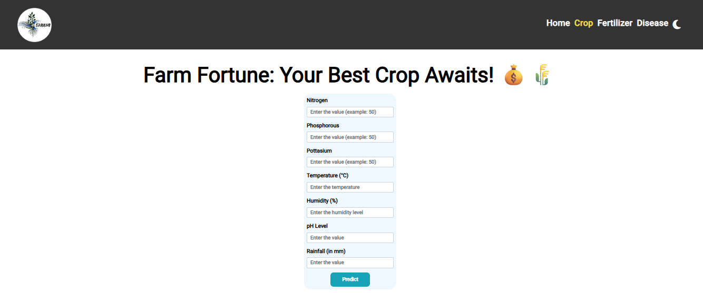
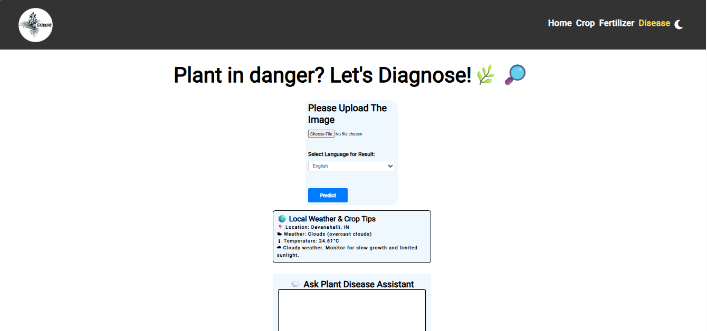
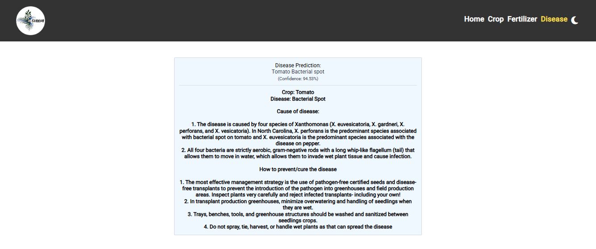

# 🌿 Plant-Advisory-and-Disease-Detection-System

 

An AI-powered web application for real-time plant disease detection, multilingual crop advisory, and personalized plant care. This project combines machine learning, computer vision, weather integration, and chatbot support to assist farmers and gardeners effectively.

---

## 🚀 Features

- 🌱 **Plant Disease Detection** via image upload (supports 38+ conditions)
- 🤖 **AI-Powered Chatbot** using Gemini / ChatOllama
- ☁️ **Weather Integration** with geolocation-based crop suggestions
- 🌐 **Multilingual Support** for user queries and responses
- 🌗 **Dark & Light Mode Themes**
- 🧠 **Gemini Pro + FAISS Search** for contextual crop advisory
- 🏷️ Real-time translation, image analysis, and treatment suggestions

---

## 🖼️ Screenshots

### 👨‍🌾 User Interface

- **Home Page**
  

- **Best Crop to Grow**
  

- **Fertilizers**
  

- **Diseases**
  

- **Disease-Prediction**
  

---

## 🧰 Tech Stack

- Python (Flask)
- Google Gemini API / ChatOllama
- OpenCV
- FAISS for Knowledge Retrieval
- Geolocation & Weather API (OpenWeatherMap)
- HTML/CSS/JavaScript (Frontend)
- GitHub Actions (CI/CD optional)

---

## 📦 Installation

### 🔁 Clone this Repository

```bash
git clone https://github.com/ShivarajNKengannavar/Plant-Advisory-and-Disease-Detection-System.git
cd Plant-Advisory-and-Disease-Detection-System
````

### Setup

```bash
cd app
python -m venv .venv
source .venv/bin/activate  # Or `.venv\Scripts\activate` on Windows
pip install -r requirements.txt
```

---

## ▶️ Usage

1. Activate your virtual environment
2. Start the backend server:

```bash
python app.py
```

3. Open your browser at:
   `http://127.0.0.1:5000` (Flask)
---

## 💻 System Requirements

* Python 3.8+
* Stable Internet (for weather/Gemini API)

---

## 🛡️ Notes

* The Gemini API is used securely with an `.env` file — do not hardcode your key.
* Images are not stored; only real-time inference is performed.
* All translations and weather queries are handled via free/public APIs.
* Chatbot falls back to a local model (ChatOllama) if Gemini fails.

---

## 👨‍💻 Developer

**Shivaraj N Kengannavar**
📧 Email: [shivarajnkengannavar@gmail.com](mailto:shivarajnkengannavar@gmail.com)
🔗 [LinkedIn](https://www.linkedin.com/in/shivarajkengannavar/)
📂 [More Projects](https://github.com/ShivarajNKengannavar)

---

## 🤝 Contributing

We welcome all kinds of contributions — bug fixes, feature suggestions, UI enhancements, and documentation improvements!

1. Fork the repo
2. Create your feature branch: `git checkout -b feature/AmazingFeature`
3. Commit your changes: `git commit -m 'Add amazing feature'`
4. Push to the branch: `git push origin feature/AmazingFeature`
5. Open a Pull Request

---

> ⭐ **Thank you for visiting this project! Your feedback, stars, and forks help the project grow!**


